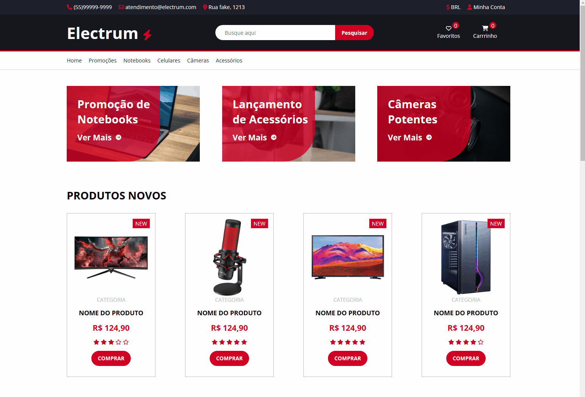

# Electrum - Loja Virtual 🛍️

LandPage de loja virtual baseado em um e-commerce da vida real
#
* #### Deploy Netlify ☁️
    * [Electrum E-commerce](https://e-commerce-electrum-bn.netlify.app/) 🛒💳
#

### Skills

> HTML com tags semânticas

> Organização e separação de componentes como variaveis, plugins, layouts e modulos Sass

> Compilador Sass para CSS

```comando do terminal
sass --watch assets/sass/app.sass:assets/css/app.css
```

> Usando biblioteca [Font Awesome](https://cdnjs.com/libraries/font-awesome) para ícones

> Usando biblioteca [Google Fonts](https://fonts.google.com/about) para fontes de texto
#

<div align='center'>
<h3>Page 📑:</h3>
<br />

</div>

#

<div align='center'>
<h3>Responsive 📲:</h3>
<br />

</div>
